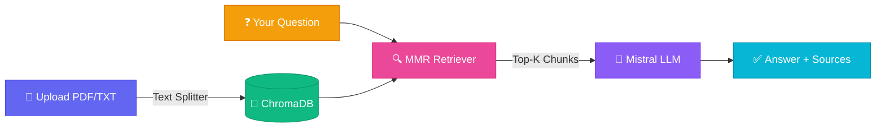

<div align="center">

# 🤖 RAG AI Assistant

> **Chat with your documents.** Upload PDFs or text files and ask questions — get precise, sourced answers powered by Mistral AI.

<br>

<!-- Animated SVG Demo -->


<br><br>

<!-- Animated Badges -->


<br><br>

<!-- Animated Typing Effect -->


</div>

---

## ✨ Features

<table>
<tr>
<td width="50%">

### 📄 Smart Document Upload
- **Drag & drop** interface with animated feedback
- **Gradient progress ring** with real-time percentage
- **Color-coded status** (green ✓ success, red ✕ error)
- Supports **PDF** and **TXT** formats

</td>
<td width="50%">

### 💬 Intelligent Chat
- **Natural language** questions about your documents
- **Source attribution** — see exactly which chunks were used
- **Typing indicators** with bouncing dot animation
- **Keyboard shortcuts** (Enter to send, `0` to clear)

</td>
</tr>
<tr>
<td width="50%">

### 🔍 Advanced RAG Pipeline
- **MMR Retrieval** for diverse, relevant results
- **Mistral Embeddings** (`mistral-embed`)
- **Mistral LLM** (`mistral-small`)
- **ChromaDB** vector storage

</td>
<td width="50%">

### 🎨 Stunning UI Design
- **Indigo-Pink gradient** theme
- **Glassmorphism** effects with backdrop blur
- **Smooth animations** (slide-in, fade, bounce)
- **Fully responsive** layout

</td>
</tr>
</table>

---

## 🚀 Quick Start

### Prerequisites
- Python 3.11+
- [Mistral AI API Key](https://console.mistral.ai/)

### 1. Clone & Setup

```bash
# Clone the repository
git clone https://github.com/yourusername/rag-ai-assistant.git
cd rag-ai-assistant

# Create virtual environment (recommended)
python -m venv venv

# Windows
venv\Scripts\activate

# macOS/Linux
source venv/bin/activate
```

### 2. Install Dependencies

```bash
pip install -r requirements.txt
```

### 3. Configure Environment

Create a `.env` file:

```env
MISTRAL_API_KEY=your_mistral_api_key_here
```

> 🔑 Get your key at [console.mistral.ai](https://console.mistral.ai/)

### 4. Launch 🚀

```bash
python api.py
```

Open **http://localhost:8000** in your browser!

---

## 📁 Project Structure

```
rag-ai-assistant/
├── 📄 api.py                  ← Local FastAPI server
├── 📁 api/
│   └── 📄 index.py            ← Vercel serverless entry
├── 📄 config.py               ← Environment configuration
├── 📄 rag_engine.py           ← Core RAG logic
├── 📄 document_processor.py   ← File handling & chunking
├── 📄 requirements.txt          ← Dependencies
├── 📄 vercel.json              ← Deployment config
├── 📁 templates/
│   └── 📄 index.html           ← Main UI
├── 📁 static/
│   ├── 📁 css/
│   │   └── 🎨 style.css       ← Animated UI styles
│   └── 📁 js/
│       └── ⚡ app.js           ← Interactive frontend
├── 📁 public/                  ← Vercel static assets
├── 📁 uploads/                 ← Uploaded files (auto)
└── 📁 db/                      ← ChromaDB store (auto)
```

---

## 🖼️ UI Showcase

<div align="center">

### Upload Experience

| Idle | Drag Over | Uploading | Success |
|:----:|:---------:|:---------:|:-------:|
| 🌫️ | 🎯 | ⏳ | ✅ |
| *Clean drop zone* | *Scale up + glow* | *Gradient progress ring* | *Green checkmark* |

<br>

### Chat Interface

| Feature | Animation |
|---------|-----------|
| User Messages | **Gradient bubble** slide-in from right |
| Bot Messages | **Glass card** fade-in from left |
| Typing | **3-dot bounce** (indigo-pink gradient) |
| Sources | **Staggered reveal** with border accent |
| Send Button | **Scale + rotate** on hover |

</div>

---

## ⚙️ How It Works



### Pipeline Steps

| Step | What Happens |
|------|-------------|
| **1. Upload** | File saved → loaded → split into 1000-char chunks with 200-char overlap |
| **2. Embed** | Each chunk embedded via `mistral-embed` → stored in ChromaDB |
| **3. Retrieve** | MMR search fetches top 3 diverse, relevant chunks from 10 candidates |
| **4. Generate** | Mistral LLM answers using only the retrieved context + strict system prompt |
| **5. Respond** | Answer returned with full source attribution |

---

## 🛠️ Tech Stack

<div align="center">

| Layer | Technology | Role |
|:-----:|:----------:|:----:|
| 🐍 | **Python 3.11+** | Core runtime |
| ⚡ | **FastAPI** | High-performance API |
| 🧠 | **Mistral AI** | LLM + Embeddings |
| 🔗 | **LangChain** | RAG orchestration |
| 💾 | **ChromaDB** | Vector storage |
| 🎨 | **Vanilla JS/CSS** | Zero-dependency UI |
| 🚀 | **Vercel** | Serverless deployment |

</div>

---

## 🌐 Deployment Options

### Option A: Local Development (Recommended)

```bash
python api.py
# → http://localhost:8000
```

✅ Documents persist  
✅ Full ChromaDB functionality  
✅ Best for development & production

---

### Option B: Vercel (Demo/Showcase)

```bash
# Install Vercel CLI
npm install -g vercel

# Login & deploy
vercel login
vercel --prod
```

⚠️ **Limitations:**
- Documents are **temporary** (serverless `/tmp`)
- Vector DB **resets** between requests
- Use only for **demos**

**Required Environment Variables:**

| Variable | Value | Required |
|----------|-------|:--------:|
| `MISTRAL_API_KEY` | Your API key | ✅ |
| `VERCEL` | `1` | ✅ |

---

### Option C: Docker (Production-Ready)

```dockerfile
FROM python:3.11-slim

WORKDIR /app
COPY requirements.txt .
RUN pip install --no-cache-dir -r requirements.txt

COPY . .
EXPOSE 8000

CMD ["uvicorn", "api:app", "--host", "0.0.0.0", "--port", "8000"]
```

```bash
docker build -t rag-assistant .
docker run -p 8000:8000 --env-file .env rag-assistant
```

---

## 🎯 API Reference

### `POST /chat`
Ask a question about your uploaded documents.

**Request:**
```json
{
  "question": "What are the main topics in this document?"
}
```

**Response:**
```json
{
  "answer": "Based on the context, the document covers...",
  "sources": [
    {
      "content": "Relevant text chunk...",
      "metadata": {
        "source": "document.pdf",
        "file_path": "/path/to/file"
      }
    }
  ]
}
```

---

### `POST /upload`
Upload a PDF or TXT file.

**Form Data:**
| Field | Type | Description |
|-------|------|-------------|
| `file` | File | PDF or TXT file |

**Response:**
```json
{
  "message": "File uploaded and indexed successfully",
  "details": {
    "filename": "document.pdf",
    "chunks": 42,
    "total_chars": 45000,
    "status": "success"
  }
}
```

---

### `GET /health`
Health check endpoint.

**Response:**
```json
{
  "status": "ok",
  "model": "mistral-small"
}
```

---

## 🎨 Animation Showcase

| Animation | Trigger | Effect |
|-----------|---------|--------|
| 🌥️ **Cloud Bounce** | Drag file over zone | Upload cloud bounces up/down |
| ⬆️ **Arrow Float** | Idle state | Upload arrow floats gently |
| 🔄 **Progress Ring** | Uploading | SVG stroke-dashoffset animates |
| 💬 **Message Slide** | New message | Slides in with cubic-bezier |
| 🔵 **Typing Dots** | Bot thinking | 3 dots bounce with stagger |
| ✨ **Button Glow** | Hover send | Gradient glow + scale + rotate |
| 🟢 **Status Pulse** | Online | Green dot with ripple ring |
| 🧹 **Clear Spin** | Hover trash | Icon rotates 15° |

---

## 📝 Configuration

Edit `config.py` to customize behavior:

```python
class Config:
    # AI Models
    EMBEDDING_MODEL = "mistral-embed"     # Embedding model
    LLM_MODEL = "mistral-small"           # Chat model

    # Chunking
    CHUNK_SIZE = 1000                      # Characters per chunk
    CHUNK_OVERLAP = 200                    # Overlap between chunks

    # Retrieval
    RETRIEVER_K = 3                        # Results to return
    RETRIEVER_FETCH_K = 10                 # Candidates to fetch
    RETRIEVER_LAMBDA = 0.5                 # MMR diversity (0=diverse, 1=relevant)
```

---

## 🤝 Contributing

We love contributions! Here's how:

```bash
# 1. Fork the repo
# 2. Create your feature branch
git checkout -b feature/amazing-feature

# 3. Commit your changes
git commit -m "✨ Add amazing feature"

# 4. Push to branch
git push origin feature/amazing-feature

# 5. Open a Pull Request 🎉
```

---

## 📄 License

```
MIT License

Copyright (c) 2026 RAG AI Assistant

Permission is hereby granted, free of charge, to any person obtaining a copy
of this software and associated documentation files (the "Software"), to deal
in the Software without restriction, including without limitation the rights
to use, copy, modify, merge, publish, distribute, sublicense, and/or sell
copies of the Software, and to permit persons to whom the Software is
furnished to do so, subject to the following conditions:

The above copyright notice and this permission notice shall be included in all
copies or substantial portions of the Software.
```

---

## 🙏 Acknowledgments

<div align="center">

| [](https://mistral.ai) | [](https://langchain.com) | [](https://trychroma.com) | [](https://fastapi.tiangolo.com) |
|:---:|:---:|:---:|:---:|
| LLM & Embeddings | RAG Framework | Vector DB | Web Framework |

</div>

---

<div align="center">

### Made with ❤️ using Mistral AI & LangChain

<br>

<!-- Animated Footer -->


<br>

**[⭐ Star this repo](https://github.com/yourusername/rag-ai-assistant)** if you found it helpful!

</div>
