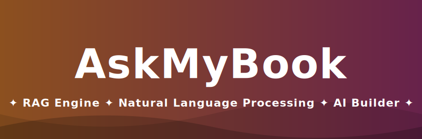

<div align="center">

<!-- Main Animated Banner -->
<a href="https://github.com/Suman18-bit/DEPLOY_REPO">
  
</a>

<!-- Typing Animation -->
<a href="https://github.com/Suman18-bit/DEPLOY_REPO">
  
</a>

<!-- Badges -->
<p align="center">
  
  
  
  
</p>

<!-- Animated GIF -->


<p align="center">
  <strong>An intelligent web application featuring Document Processing and a Natural Language Processing RAG Engine.</strong>
</p>

</div>

---

## ✨ Features

- 🧠 **RAG Engine (`rag_engine.py`):** Core retrieval-augmented generation logic for highly accurate, context-aware AI responses.
- 📄 **Smart Document Processing (`document_processor.py`):** Automated ingestion, parsing, and chunking of text data for the vector database.
- 🎨 **Interactive Web UI:** Clean, responsive front-end interface built with custom CSS and JS.

---

## 🛠️ Tech Stack

- **Backend:** Python
- **AI/NLP:** Retrieval-Augmented Generation (RAG) Architecture
- **Frontend:** HTML5, CSS3, JavaScript

---

## 📂 Repository Structure

```graphql
📦 DEPLOY_REPO
 ┣ 📂 db                    # Database storage and configuration
 ┣ 📂 public/data           # Publicly accessible datasets and documents
 ┣ 📂 static                # Static web assets
 ┃ ┣ 📂 css                 # Stylesheets
 ┃ ┗ 📂 js                  # Client-side scripts
 ┣ 📂 templates             # HTML Web Templates
 ┣ 📜 app.py                # Main Application Entry Point
 ┣ 📜 rag_engine.py         # Core NLP and RAG implementation logic
 ┣ 📜 document_processor.py # Document parsing and extraction pipeline
 ┣ 📜 requirements.txt      # Python dependencies
 ┗ 📜 LICENSE               # Open-source license

```

---

## 🚀 Getting Started

Follow these instructions to set up the project on your local machine for development and testing.

### Prerequisites

Make sure you have the following installed:

* [Python 3.8+](https://www.python.org/downloads/)
* [Git](https://git-scm.com/)

### 1. Clone the repository

```bash
git clone [https://github.com/Suman18-bit/DEPLOY_REPO.git](https://github.com/Suman18-bit/DEPLOY_REPO.git)
cd DEPLOY_REPO

```

### 2. Set up a virtual environment (Recommended)

```bash
python -m venv venv

# On macOS/Linux:
source venv/bin/activate  

# On Windows:
venv\Scripts\activate

```

### 3. Install dependencies

```bash
pip install -r requirements.txt

```

### 4. Configure Environment Variables

Create a `.env` file in the root directory and add your required API keys (e.g., OpenAI, HuggingFace) and database connections.

```env
# Example .env file
OPENAI_API_KEY=your_api_key_here
DATABASE_URL=your_database_url_here

```

### 5. Run the application

```bash
python app.py

```

*Navigate to `http://localhost:5000` (or your terminal's configured port) in your web browser to interact with the application.*

---

## 👨‍💻 Author

**Suman Seth**

* Data Scientist | ML Engineer | AI Builder
* GitHub: [@Suman18-bit](https://www.google.com/search?q=https://github.com/Suman18-bit)

---

## 🤝 Contributing

Contributions, issues, and feature requests are always welcome!

1. Fork the Project
2. Create your Feature Branch (`git checkout -b feature/AmazingFeature`)
3. Commit your Changes (`git commit -m 'Add some AmazingFeature'`)
4. Push to the Branch (`git push origin feature/AmazingFeature`)
5. Open a Pull Request

Feel free to check the [Issues Page](https://www.google.com/search?q=https://github.com/Suman18-bit/DEPLOY_REPO/issues) for active tasks.
